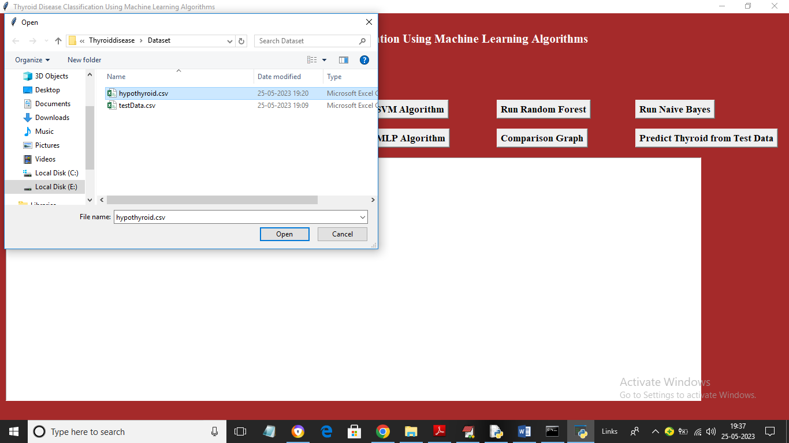
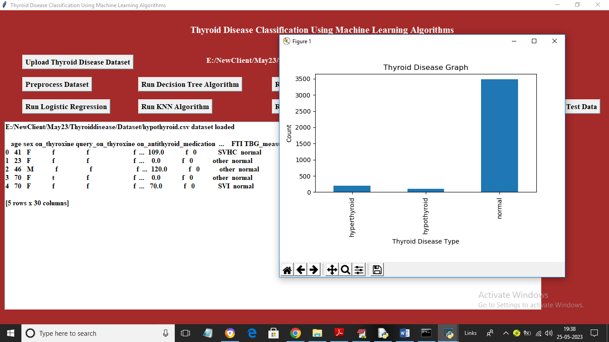
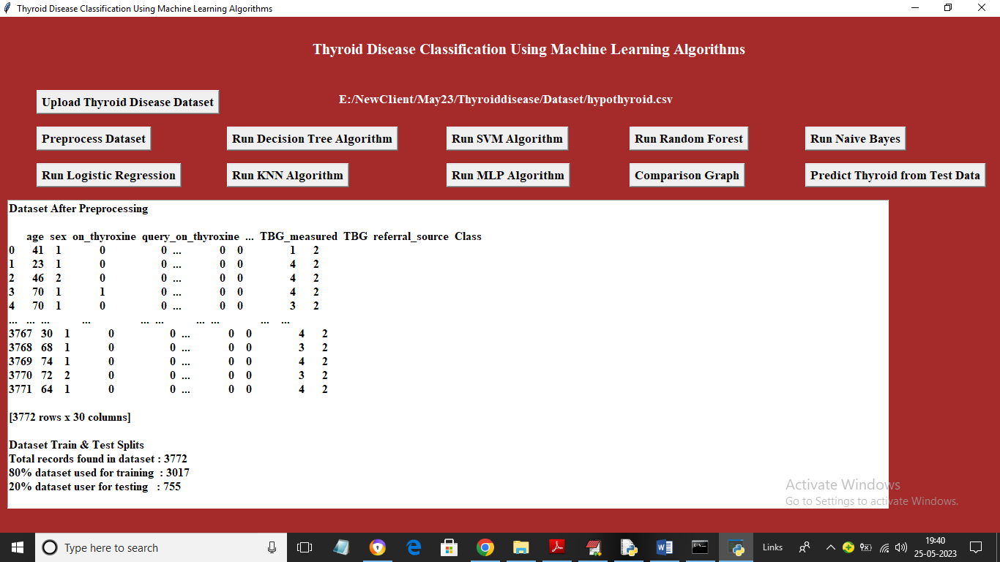
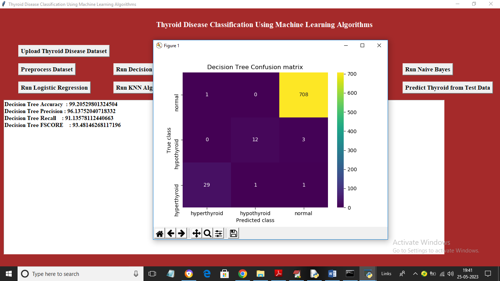
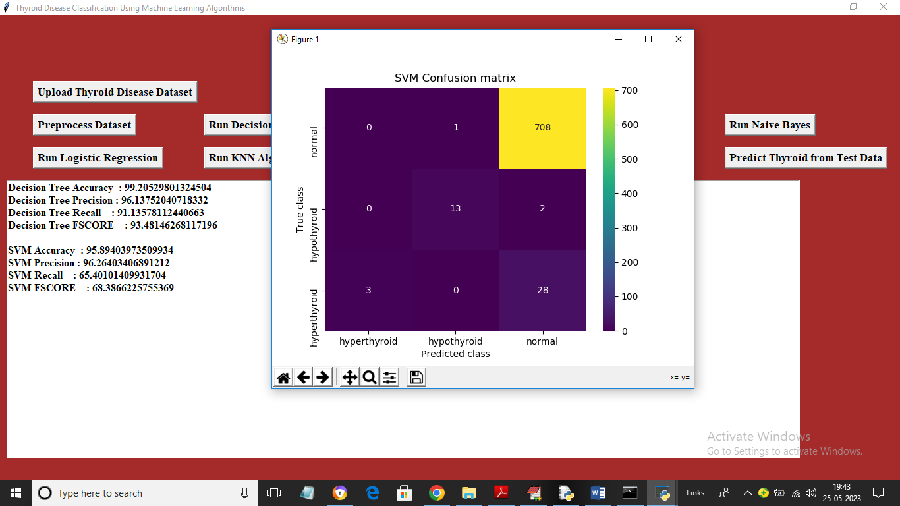
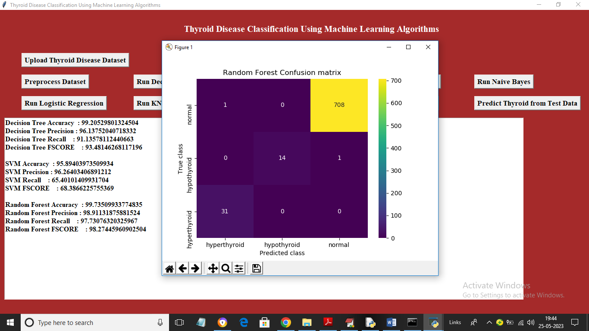
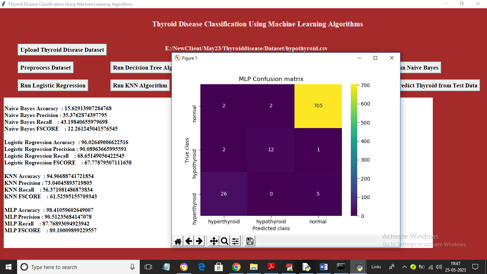
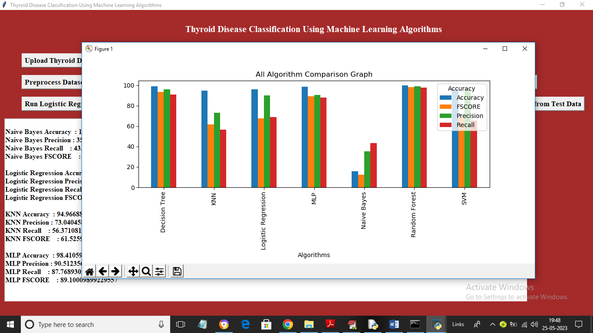
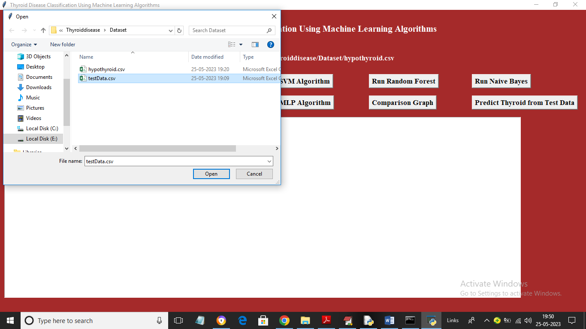
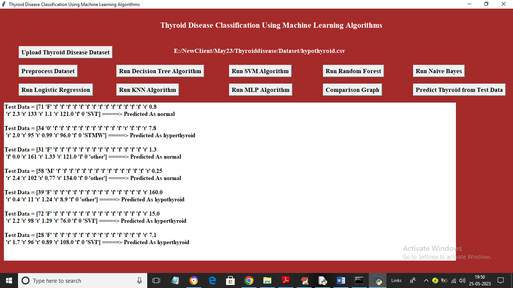

# Thyroid Disease Classification Using Machine Learning Algorithms

This project provides a graphical user interface (GUI) for classifying thyroid diseases using various machine learning algorithms. It enables users to preprocess datasets, train models, and make predictions. The project is implemented using Python and leverages Tkinter for the GUI.

---

## Features

- **Dataset Upload**: Upload a thyroid disease dataset in CSV format.
- **Preprocessing**: Handle missing values, encode categorical data, and standardize numerical features.
- **Model Training**:
  - Decision Tree Classifier
  - Support Vector Machine (SVM)
  - Random Forest Classifier
  - Multi-Layer Perceptron (MLP)
- **Model Evaluation**: Evaluate models using metrics like accuracy, precision, recall, F1-score, and confusion matrix.
- **Comparison Graph**: Visualize performance metrics of all algorithms.
- **Prediction**: Predict thyroid disease types from test data.
- **Interactive GUI**: User-friendly GUI built with Tkinter.

---

## Installation

### Prerequisites

Ensure you have Python 3.7 or later installed. Install the required libraries using the command:

```bash
pip install -r requirements.txt
```

### Clone the Repository

```bash
git clone https://github.com/<your-username>/thyroid-disease-classification.git
cd thyroid-disease-classification
```

---

## Usage

1. Run the application:

   ```bash
   python thyroid_disease_gui.py
   ```

2. Use the GUI to:
   - Upload the dataset.
   - Preprocess the data.
   - Train models using available algorithms.
   - Visualize model performance metrics.
   - Predict thyroid disease using test data.

---

## Dataset

- The dataset should be in CSV format and contain a `Class` column representing the disease type.
- Example file path: `Dataset/thyroid_dataset.csv`.

---

## GUI Overview

- **Upload Dataset**: Load your CSV file into the application.
- **Preprocess Dataset**: Convert categorical data, handle missing values, and split data into training/testing sets.
- **Run Algorithms**: Train models and evaluate their performance.
- **Comparison Graph**: View a bar chart comparing metrics for all algorithms.
- **Predict Test Data**: Classify new samples using the trained Random Forest model.

---

## Requirements

The following Python libraries are required:

- `tkinter`
- `numpy`
- `pandas`
- `scikit-learn`
- `matplotlib`
- `seaborn`

A `requirements.txt` file is included for easy installation.

---

## Example Output

- **Performance Metrics**: Accuracy, Precision, Recall, F1-score for each model.
- **Visualization**: Confusion matrix heatmaps and bar charts comparing algorithms.
- **Prediction**: Output the predicted thyroid disease type for given test data.

---

## Contributing

- **K. GAYATHRI BHAVYA**
- **G. KUSHAL**
- **J. VINAY**


---

## License

This project is licensed under the MIT License. See the [LICENSE](LICENSE) file for details.

---

## Screenshots

Main Frame<br>
<br>
Selecting and uploading dataset file<br>
<br>
Applying Processing technique<br>
<br>
Run Decision Tree Algorithm<br>
<br>
Run SVM Algorithm<br>
<br>
Run Random Forest Algorithm<br>
<br>
Run MLP Algorithm<br>
<br>
Comparision graph<br>
<br>
accuracy and other metrics<br>
<br>
Test data<br>
<br>
predicted thyroid disease <br>
<br>
